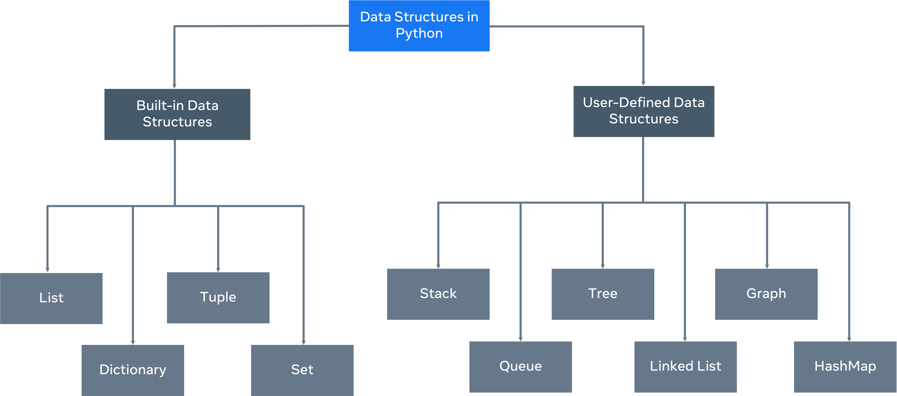

Practicing python for learning and upgrading the skills, trying to be consistant
This reading introduces you to data structures. So far, you have only stored small bits of data in a variable. This was either an integer, Boolean or a string. 

But what happens if you need to work with more complex information, such as a collection of data like a list of people or a list of companies? 

Data structures are designed for this very purpose.

Data structures in Python
A data structure allows you to organize and arrange your data to perform operations on them. Python has the following built-in data structures: List, dictionary, tuple and set. These are all considered non-primitive data structures, meaning they are classed as objects, this will be explored later in the course. 

Along with the built-in data structures, Python allows users to create their own. Data structures such as Stacks, Queues and Trees can all be created by the user. 

Each data structure can be designed to solve a particular problem or optimize a current solution to make it much more performant.

Mutability and Immutability
Data Structures can be mutable or immutable. The next question you may ask is, what is mutability? Mutability refers to data inside the data structure that can be modified. For example, you can either change, update, or delete the data when needed. A list is an example of a mutable data structure. The opposite of mutable is immutable. An immutable data structure will not allow modification once the data has been set. The tuple is an example of an immutable data structure.

